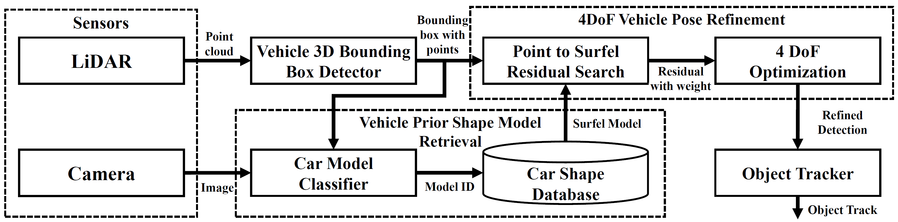
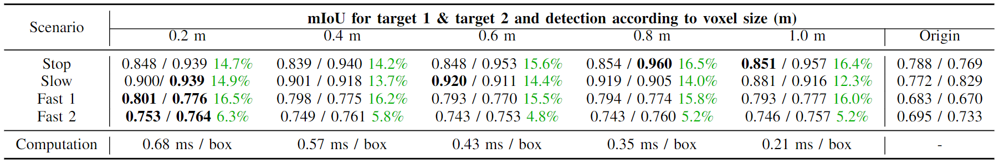
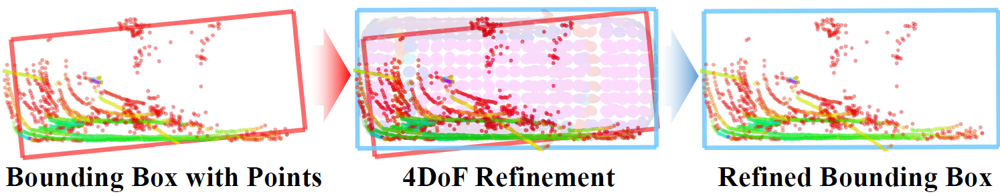

# CAD_Refinement
Repository for paper "*Enhanced Pose Detection of Nearby Vehicles Using LiDAR and Prior Shape for Autonomous Driving*"

This repository provides code of prior model-based detection refinement moudle, dataset and evaluation tool

(The code will be uploaded after the review process!)

<div align="center">

<br />
<b>System architecture</b>
</div>
<br>

<div align="center">

<br />
<b>Detection improvement (mIoU) results by various voxel size</b>
</div>
<br>


## Purpose
Enhancing LiADR-based 3D bounding box detection with prior car shape model 

## Method

1. Downsample vehicle prior model into **Surfel Model**

<div align="center">

<br />
<b>Downsampling CAD model to Surfel model</b>
</div>
<br>
<!--  -->


2. Execute 4-DoF Point-to-Surfel registration.
<div align="center">

<br />
<b>Refinement process</b>
</div>
<br>

## Demo
* Stop Scenario Comparision
<div align="center">

<br />
<b>(Left) Tracking without refinement : Due to unstable detection, static objects become dynamic   
(Right) Tracking with refinement : Static due to stable detection</b>
</div>
<br>


## Run Algorithm
1. Detection only
```
roslaunch box_point_generator box_point_generator.launch
roslaunch cad_registration cad_registration.launch
```

2. Run Tracking (TBD)

# Evaluation


## Evaluation Setup & Sensors
- LiDAR : Velodyne VLP-32C   
- GNSS : Novtel CPT-7, Novatel Pwrpak7

<div align="center">

<br />
<b>Evaluation setup and test track</b>
</div>
<br>

## Scenario Example
<div align="center">

<br />
<b>4 scenarios</b>
</div>
<br>

1. Stop Scenario (18.3 sec): Target vehicles static. Ego vehicle moves slowly.
2. Slow Scenario (30.0 sec): The target vehicles and the ego vehicle move slowly in parallel.
3. Fast Scenario short (159 sec) : Target vehicles and ego vehicles drive at high speed, overtaking each other
4. Fast Scenario long (399 sec) : Target vehicles and ego vehicles drive at high speed, overtaking each other

## Scenario Bag file

[Google Drive Link](https://drive.google.com/drive/folders/1VgPlIYq697lHDboZdOffiofuVNBP87-y?usp=sharing)
1. Stop Scenario
    1. Ego: /Ego_Vehicle/stop_3_ego.bag
    2. Target 1: /Target_Vehicle_1/target_1_3.bag
    3. Target 2: /Target_Vehicle_2/target_2_3.bag
2. Slow Scenario
    1. Ego: /Ego_Vehicle/slow_0_ego.bag
    2. Target 1: /Target_Vehicle_1/target_1_0.bag
    3. Target 2: /Target_Vehicle_2/target_2_0.bag
3. Fast Scenario short
    1. Ego: /Ego_Vehicle/fast_3_short_ego.bag
    2. Target 1: /Target_Vehicle_2/target_1_3.bag
    3. Target 2: /Target_Vehicle_2/target_2_3.bag
4. Fast Scenario long
    1. Ego: /Ego_Vehicle/fast_2_long_ego.bag
    2. Target 1: /Target_Vehicle_2/target_1_2.bag
    3. Target 2: /Target_Vehicle_2/target_2_2.bag

### Data Preparation

1. Need GNSS Topic from target vehicle (Existed in bag files)
* /novatel/oem7/inspvax

2. Ego detection topoic type should be "**autoku_types::DetectsObjects**" (Will be change to a general topic type.)
* topic_name/ego_detection_topic_name


## Run Evaluation Tool
0. Setup system.yaml file
1. Launch Evaluation tool
```
roslaunch detection_evaluation detection_evaluation.launch
```
2. rviz file in /rviz/autoku_evaluation.rviz

3. Type scene number when "*Enter index of scene to visualize ('q' to quit)*" pop up

## Contact
If you have any questions, please let me know:
- Jaeyoung Jo (`wodud3743@gmail.com`)